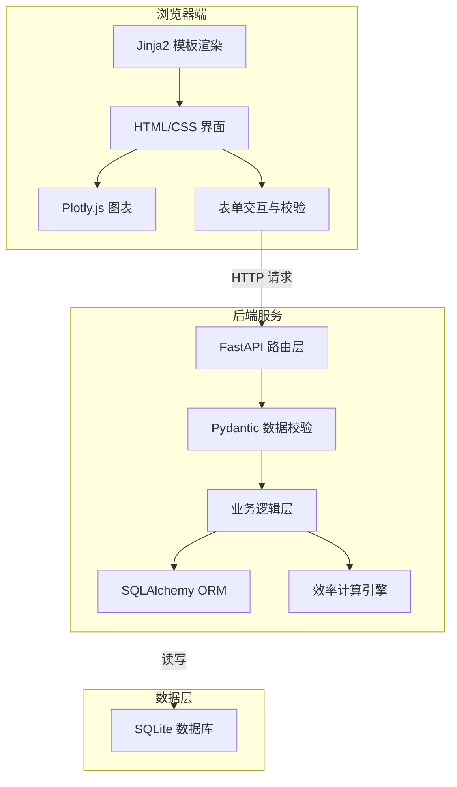
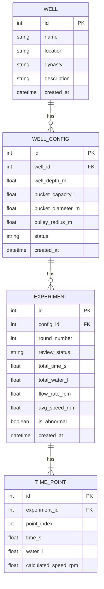

# 古井汲水效率复原平台 - 技术架构文档

## 1. 架构设计



## 2. 技术选型

- **后端框架**：FastAPI（Python 3.11+），高性能异步 Web 框架
- **模板引擎**：Jinja2，服务端渲染 HTML
- **数据库**：SQLite 3 + SQLAlchemy 2.0 ORM，轻量级嵌入式数据库
- **数据校验**：Pydantic v2，强类型数据模型
- **前端可视化**：Plotly.js CDN，交互式科学图表
- **样式方案**：原生 CSS + CSS 变量，无需前端构建工具
- **HTTP 服务**：uvicorn，ASGI 服务器

## 3. 目录结构

```
nyh-60/
├── main.py                    # FastAPI 应用入口
├── requirements.txt           # Python 依赖
├── database.py                # 数据库连接与初始化
├── models.py                  # SQLAlchemy 数据模型
├── schemas.py                 # Pydantic 数据校验模型
├── crud.py                    # 数据库 CRUD 操作
├── calculator.py              # 汲水效率计算引擎
├── static/
│   ├── css/
│   │   └── style.css          # 全局样式
│   └── js/
│       └── app.js             # 前端交互逻辑
├── templates/
│   ├── base.html              # 基础布局模板
│   ├── index.html             # 古井列表页
│   └── well_detail.html       # 古井详情页
└── well_efficiency.db         # SQLite 数据库（自动创建）
```

## 4. 路由定义

| 方法 | 路由 | 用途 |
|-------|-------|---------|
| GET | `/` | 古井列表首页 |
| GET | `/wells/{well_id}` | 古井详情页 |
| POST | `/wells` | 创建古井档案 |
| PUT | `/wells/{well_id}` | 更新古井基本信息 |
| DELETE | `/wells/{well_id}` | 删除古井档案 |
| PUT | `/wells/{well_id}/config` | 更新辘轳结构参数，标记旧实验待复核 |
| POST | `/wells/{well_id}/experiments` | 新增一轮实验数据 |
| DELETE | `/wells/{well_id}/experiments/{exp_id}` | 删除一轮实验 |
| GET | `/api/wells/{well_id}/efficiency` | 获取效率计算结果 JSON |
| GET | `/api/wells/{well_id}/comparison` | 获取多方案对比数据 JSON |

## 5. 数据模型

### 5.1 ER 图



### 5.2 DDL

```sql
CREATE TABLE well (
    id INTEGER PRIMARY KEY AUTOINCREMENT,
    name VARCHAR(100) NOT NULL,
    location VARCHAR(200),
    dynasty VARCHAR(50),
    description TEXT,
    created_at DATETIME DEFAULT CURRENT_TIMESTAMP
);

CREATE TABLE well_config (
    id INTEGER PRIMARY KEY AUTOINCREMENT,
    well_id INTEGER NOT NULL REFERENCES well(id) ON DELETE CASCADE,
    well_depth_m REAL NOT NULL CHECK (well_depth_m > 0),
    bucket_capacity_l REAL NOT NULL CHECK (bucket_capacity_l > 0),
    bucket_diameter_m REAL NOT NULL CHECK (bucket_diameter_m > 0),
    pulley_radius_m REAL NOT NULL CHECK (pulley_radius_m > 0),
    status VARCHAR(20) DEFAULT 'active',
    created_at DATETIME DEFAULT CURRENT_TIMESTAMP
);

CREATE TABLE experiment (
    id INTEGER PRIMARY KEY AUTOINCREMENT,
    config_id INTEGER NOT NULL REFERENCES well_config(id) ON DELETE CASCADE,
    round_number INTEGER NOT NULL,
    review_status VARCHAR(20) DEFAULT 'valid',
    total_time_s REAL,
    total_water_l REAL,
    flow_rate_lpm REAL,
    avg_speed_rpm REAL,
    is_abnormal BOOLEAN DEFAULT 0,
    created_at DATETIME DEFAULT CURRENT_TIMESTAMP,
    UNIQUE(config_id, round_number)
);

CREATE TABLE time_point (
    id INTEGER PRIMARY KEY AUTOINCREMENT,
    experiment_id INTEGER NOT NULL REFERENCES experiment(id) ON DELETE CASCADE,
    point_index INTEGER NOT NULL,
    time_s REAL NOT NULL CHECK (time_s >= 0),
    water_l REAL NOT NULL CHECK (water_l >= 0),
    calculated_speed_rpm REAL,
    UNIQUE(experiment_id, point_index)
);
```

## 6. 效率计算算法

### 6.1 核心公式

1. **绳索线速度**：v = Δh / Δt = (Δwater × 10⁻³) / (π × r_bucket² × ρ)  m/s
   - 简化近似：根据井深和总汲水量估算平均提升高度
2. **绳轮角速度**：ω = v / r_pulley  rad/s
3. **绳轮转速**：RPM = ω × 60 / (2π)  rpm
4. **单次汲水耗时**：T = t_end - t_start  s
5. **单位时间出水量**：Q = V_total / T × 60  L/min
6. **异常检测**：若 Q < 0.5 × mean(Q_same_config)，标记为异常

### 6.2 异常检测逻辑

```python
def detect_anomaly(experiments: List[Experiment]) -> None:
    flow_rates = [e.flow_rate_lpm for e in experiments if e.flow_rate_lpm]
    if len(flow_rates) < 2:
        return
    avg = sum(flow_rates) / len(flow_rates)
    for exp in experiments:
        exp.is_abnormal = exp.flow_rate_lpm < (avg * 0.5) if exp.flow_rate_lpm else False
```
