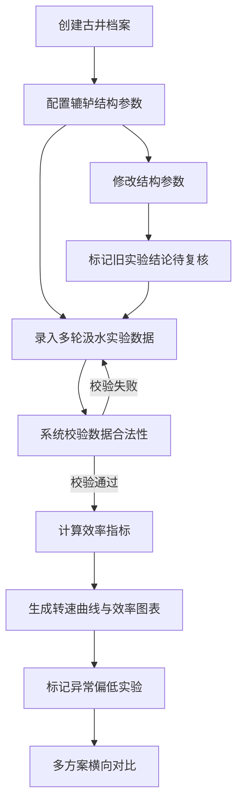

# 古井汲水效率复原平台 - 产品需求文档

## 1. 产品概述

古井汲水效率复原平台是一个用于研究传统辘轳井汲水效率的科学实验工具。通过建立古井档案、配置辘轳结构参数、录入多轮汲水实验数据，系统可以计算并可视化单次汲水耗时、单位时间出水量、绳轮转速曲线，并比较不同桶径和转速方案下的效率差异。

- **目标用户**：历史文化研究员、水利史学者、传统工艺研究者
- **核心价值**：将抽象的传统汲水工艺转化为可量化、可比较的数据指标

## 2. 核心功能

### 2.1 功能模块

1. **古井档案管理**：创建、编辑、删除古井档案，记录井的基本信息
2. **辘轳结构参数配置**：设置井深、桶容量、桶径、绳轮半径等物理参数
3. **实验数据录入**：录入多轮汲水实验的时间点和出水量数据
4. **效率计算与分析**：自动计算单次汲水耗时、单位时间出水量、绳轮转速
5. **数据可视化**：Plotly.js 绘制转速曲线、效率对比图
6. **效率异常检测**：自动标记效率异常偏低的实验记录

### 2.2 页面详情

| 页面名称 | 模块名称 | 功能描述 |
|-----------|-------------|---------------------|
| 首页/古井列表 | 古井档案卡片 | 展示所有古井，支持创建、编辑、删除 |
| 古井详情页 | 基本信息面板 | 显示古井名称、位置、年代等信息 |
| 古井详情页 | 结构参数配置区 | 配置井深、桶容量、桶径、绳轮半径，修改时标记旧实验待复核 |
| 古井详情页 | 实验数据录入表 | 录入轮次、时间点、出水量数据，实时校验 |
| 古井详情页 | 效率统计面板 | 展示单次汲水耗时、单位时间出水量等指标 |
| 古井详情页 | 可视化图表区 | Plotly.js 绘制绳轮转速曲线、效率对比图 |
| 古井详情页 | 效率对比面板 | 横向比较不同桶径、转速方案的效率差异 |

## 3. 核心流程

## 4. 用户界面设计

### 4.1 设计风格

- **主色调**：土褐色系（#8B4513 深棕色、#D2B48C 棕褐色、#F5F5DC 米色），体现古朴素雅的风格
- **辅助色**：深青色（#2F4F4F）用于数据图表
- **字体**：标题使用「思源宋体」体现历史感，正文使用「思源黑体」保证可读性
- **布局**：左右分栏布局，左侧导航 + 参数配置，右侧数据展示与图表
- **装饰元素**：仿古木纹纹理背景，绳纹边框装饰

### 4.2 页面设计概览

| 页面名称 | 模块名称 | UI 元素 |
|-----------|-------------|-------------|
| 古井列表 | 档案卡片 | 悬停阴影、木纹背景、删除按钮 |
| 古井详情 | 参数配置 | 表单分组、校验提示、修改确认弹窗 |
| 古井详情 | 数据录入表 | 动态行添加、实时校验高亮、异常行红色标记 |
| 古井详情 | 图表区 | Plotly.js 交互式图表、导出 PNG 按钮 |
| 古井详情 | 对比面板 | 表格横向对比、色阶热力图标识效率高低 |

### 4.3 响应式

采用桌面优先设计，在 1280px 以上分辨率展示最佳效果；平板端自动切换为上下堆叠布局；移动端折叠侧边栏为汉堡菜单。

## 5. 数据校验规则

1. **井深**：必须大于 0 米
2. **桶容量**：必须大于 0 升
3. **绳轮半径**：必须大于 0 米
4. **实验时间点**：同一轮次内时间点必须严格递增
5. **实际出水量**：不能超过桶容量
6. **实验轮次**：同一古井同一结构参数下不能重复提交相同轮次
7. **结构参数变更**：修改后旧实验数据标记为「待复核」状态
8. **效率异常**：低于同参数组平均值 50% 的实验标记为「异常偏低」
